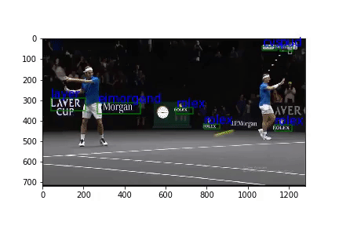

# Video Text Detection and Recognition

This is an implementation of an end to end pipeline to detect and recognize text from youtube videos. The text detection is based on 
[SSD: Single Shot MultiBox Detector](https://arxiv.org/pdf/1512.02325.pdf) retrained on single text class using [Coco-Text](https://vision.cornell.edu/se3/coco-text-2/) dataset and text recognition is based on Convolutional Recurrent Neural Network as described in [An End-to-End Trainable Neural Network for Image-based Sequence Recognition and Its Application to Scene Text Recognition](https://arxiv.org/pdf/1507.05717.pdf) 

[Slide deck](https://goo.gl/kmoTnm)

Please see Demo notebook as a starting point. Use it to provide your youtube url to either:
1. Get text detection/recognition results in JSON format (or)
2. Generate a new video with overlayed bounding boxes for all text and their respective transcriptions.

# Requirements
All requirements are captured in the requirements.txt. Please switch to your virtual environment based on your preferences and install them (pip install -r requirements.txt)

# Directory structure:
- Demo.ipynb: Demo notebook as described above
- videotext.py: Main entry point which connects various pieces of the pipeline. 
- detection.py and detection: detection.py abstracts detection functionality. See [detection](#detection) section for more details.
- recognition.py and crnn.pytorch: recognition.py abstracts recognition functionality. See [recognition](#recognition) section for more details
- utilities.py: Holds all other helper functions required for E2E video text detection and recognition.
- data_explore_eval: Contains utilities specific to various datasets and evaluation scripts. Also contains scripts to generate submissions for ICDAR17 - Robust reading competition on Coco-text

# Detection
Our detection model is based on [Tensorflow's object detection models](https://github.com/tensorflow/models/tree/master/research/object_detection) and the [detection model zoo](https://github.com/tensorflow/models/blob/master/research/object_detection/g3doc/detection_model_zoo.md)

We transfer learn on Mobile SSD network. The original network was trained on coco dataset (natural objects) for detection task. We retrain the network for text detection (single class) using Coco-Text dataset. 

## Inference

detection.py loads frozen Tensorflow inference graph and runs inference for our data.

## Training
Please follow instructions provided by [Tensorflow's object detection](https://github.com/tensorflow/models/tree/master/research/object_detection) along with scripts and configs provided in detection/ folder.

### Model configs
We have also experimented with faster-RCNN pretrained on Coco, for which we provide the config file as well.
1. ssd_mobilenet_v1_coco.config
2. faster_rcnn_resnet101_pets_coco.config

### Class definition
See [text.pbtxt](detection/text.pbtxt)

### Generate TFRecords
Script used to generate TF records for use with this model is at [coco-text/Coco-Text%20to%20TFRecords.ipynb](coco-text/Coco-Text%20to%20TFRecords.ipynb)

# Recognition

We leverage Convolutional Recurrent Network for recognition purposes. 

## Inference

recognition.py holds helper functions for recognition task. Loads Convolutional Recurrent Network weights file and runs inference. It is adapted from [caffe implementation](https://github.com/bgshih/crnn) from paper authors Shi etal and pytorch implementation by [@meijieru](https://github.com/meijieru/crnn.pytorch) model. See crnn.pytorch folder for more details. Please see the original implementation for training instructions.
 
# Web server
We have a basic web server serving video analysis requests. To start, execute following in this directory:

$ python flask_server.py

Files:
- flask_server.py - Contains basic flask app
- templates - Contains html for flask app
- static - Holds demo videos

# Data Explore and evaluation 
See directory data_explore_eval/

Coco-text:
- coco-text: Helper functions to work with Coco-Text data. Also contains Coco-Text Preparation notebook to translate coco-text to TFRecord to use with Tensorflow detection model.
- Eval_Coco_text_val_set.ipynb: Contains code to evaluate our model on coco-text benchmark

SynthText:
- synth_utils.py: Helper script to prepare SynthText data
- SynthText Data Preparation notebook[In progress]: Scripts to translate Synthetext data to TFrecord to be used with Tensorflow detection model

Also contains script to generate submissions for ICDAR17 and run evaluations offline

# Assets
Download weights from [Google drive](https://drive.google.com/drive/folders/0B2zzsNPEVylSYmUwTnYweXpkZ00?usp=sharing) and put it into a folder named weights/
